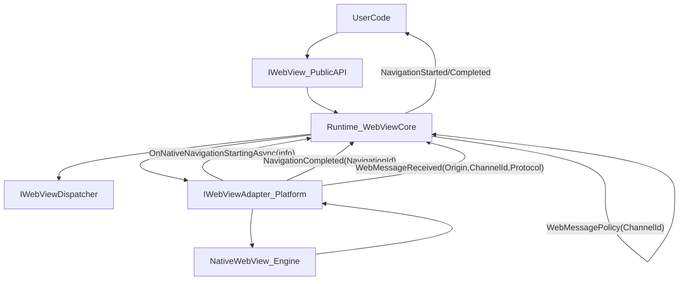

# Fulora 设计文档

> **项目愿景与目标**: 参见 [PROJECT.md](../openspec/PROJECT.md)
> **交付路线图**: 参见 [ROADMAP.md](../openspec/ROADMAP.md)

---

## 1. 目标与设计原则

### 🎯 目标

构建一个跨平台混合应用框架（Hybrid App Framework），基于 Avalonia UI，使开发者能够以原生性能和体积，获得 Web-first 级别的开发效率：

**核心目标**（详见 [PROJECT.md §3.1](../openspec/PROJECT.md#31-core-goals-must-achieve)）：
- **G1 — Type-Safe Bidirectional Bridge**: 源码生成器驱动的 C# ↔ JS 类型安全通信
- **G2 — First-Class SPA Hosting**: 开箱即用的前端应用托管（`app://` 协议）
- **G3 — Secure by Default**: 基于能力的安全模型，Web 内容只能调用显式暴露的方法
- **G4 — Contract-Driven Testability**: 所有功能可通过 MockAdapter 测试，无需真实浏览器

**已达成基础目标**（Phase 0）：
- 5 平台原生 WebView 适配器（Windows/macOS/iOS/Android/Linux）
- 完整导航控制（拦截、取消、重定向关联）
- WebMessage 桥接 + 策略（Origin、Channel、Protocol 检查）
- 丰富功能集：Cookies、Commands、Screenshot、PDF、RPC、Zoom、Find、Preload、ContextMenu、Download、Permission、WebResource
- 1113 单元测试 + 180 集成测试，95%+ 行覆盖率

### 🧠 设计原则

1. **契约优先**：先定义接口和契约，无平台依赖，写测试驱动契约行为。
2. **跨平台隔离与适配器模式**：通过适配器抽象层隔离平台差异，使用 DI 容器注入平台实现。
3. **可测试 & Mockable**：所有公开 API 均基于接口，事件与回调提供模拟触发机制。
4. **安全即架构**：安全不是配置项，而是通过 Bridge 暴露面 + Policy 管道在架构层面保证。
5. **渐进式采用**：从简单 WebView 控件到完整 Hybrid 框架，每一步都是可选的增量。

---

## 2. 核心模块架构（分层）

```
Agibuild.WebView
│
├── Core
│   ├─ IWebView
│   ├─ IWebDialog
│   ├─ IWebAuthBroker
│   ├─ IWebViewEnvironmentOptions
│   └─ NativeInterop
│
├── PlatformAdapters
│   ├─ WindowsWebView2Adapter
│   ├─ WKWebViewAdapter
│   ├─ AndroidWebViewAdapter
│   └─ GtkWebViewAdapter
│
├── Runtime（语义层）
│   ├─ WebViewCore（唯一契约语义实现者）
│   └─ AdapterHost（native 导航拦截回调入口）
│
├── Services
│   ├─ ScriptInvoker
│   ├─ MessageSerializer
│   ├─ NavigationManager
│   └─ CookieManager
│
└── Tests
    ├─ ContractTests
    ├─ MockAdapters
    └─ IntegrationSpecs
```

### 2.1 系统架构图（Full-control navigation）

该图展示了“对网页内部任何导航都可拦截/可取消”的关键交互点：adapter 在 native 引擎触发“即将导航”时，**必须先回调 Runtime**；Runtime 统一触发对外 `IWebView.NavigationStarted` 并返回 allow/deny。



关键约束（v1）：
- `IWebView.NavigationStarted` 是对外唯一契约 Started（可取消、携带 `NavigationId`）。
- adapter 不暴露“Started 事件”作为契约入口；它只通过 `IWebViewAdapterHost` 回调询问是否允许导航，并用 host 下发的 `NavigationId` 上报 `NavigationCompleted`。
- Redirect 使用 `CorrelationId` 关联为同一 `NavigationId`，并允许对外多次 `NavigationStarted`（同一 id，不同 `RequestUri`）以支持逐跳拦截。

---

## 3. 公共契约层（核心 API & 接口）

### 3.1 IWebView — 主浏览器控件合同

```csharp
public interface IWebView
{
    Uri Source { get; set; }
    bool CanGoBack { get; }
    bool CanGoForward { get; }

    Task NavigateAsync(Uri uri);
    Task NavigateToStringAsync(string html);

    Task<string?> InvokeScriptAsync(string script);

    bool GoBack();
    bool GoForward();
    bool Refresh();
    bool Stop();

    ICookieManager? TryGetCookieManager();
    ICommandManager? TryGetCommandManager();

    event EventHandler<NavigationStartingEventArgs> NavigationStarted;
    event EventHandler<NavigationCompletedEventArgs> NavigationCompleted;
    event EventHandler<NewWindowRequestedEventArgs> NewWindowRequested;
    event EventHandler<WebMessageReceivedEventArgs> WebMessageReceived;
    event EventHandler<WebResourceRequestedEventArgs> WebResourceRequested;
    event EventHandler<EnvironmentRequestedEventArgs> EnvironmentRequested;
}
```

### 3.2 IWebDialog — 弹窗 Web 模式

```csharp
public interface IWebDialog : IWebView
{
    string? Title { get; set; }
    bool CanUserResize { get; set; }

    void Show();
    bool Show(IPlatformHandle owner);
    void Close();

    bool Resize(int width, int height);
    bool Move(int x, int y);

    event EventHandler Closing;
}
```

### 3.3 IWebAuthBroker — Web 认证流程

```csharp
public interface IWebAuthBroker
{
    Task<WebAuthResult> AuthenticateAsync(
        ITopLevelWindow owner,
        AuthOptions options);
}
```

### 3.4 IWebViewEnvironmentOptions

```csharp
public interface IWebViewEnvironmentOptions
{
    bool EnableDevTools { get; set; }
    // platform-specific options
}
```

### 3.5 INativeWebViewHandleProvider

```csharp
public interface INativeWebViewHandleProvider
{
    IPlatformHandle? TryGetWebViewHandle();
}
```

---

## 4. 事件契约与参数定义

```csharp
public class NavigationStartingEventArgs : EventArgs
{
    public Uri RequestUri { get; }
    public bool Cancel { get; set; }
}
```

其他事件如 `NavigationCompletedEventArgs`、`WebMessageReceivedEventArgs`、`WebResourceRequestedEventArgs` 都严格契合官方。

---

## 5. Platform Adapters 抽象与实现

### 5.1 适配器接口

```csharp
public interface IWebViewAdapter
{
    void Initialize(IWebViewAdapterHost host);
    Task NavigateAsync(Guid navigationId, Uri uri);
    Task NavigateToStringAsync(Guid navigationId, string html);

    bool GoBack(Guid navigationId);
    bool GoForward(Guid navigationId);
    bool Refresh(Guid navigationId);
    bool Stop();
}
```

### 5.1.1 设计要点：消除双 Started 源的歧义

- `IWebView.NavigationStarted` 是对外唯一契约事件（可取消、可关联 NavigationId）。
- adapter 不直接暴露“Started 事件”作为契约入口；相反，adapter 在 native 引擎触发“即将导航”时通过 `IWebViewAdapterHost` 回调 Runtime，让 Runtime 统一触发 `IWebView.NavigationStarted` 并做 allow/deny 决策。

这样可以实现“网页内部触发的任何跳转都可拦截”，同时避免“adapter 层 started 钩子”与 `IWebView.NavigationStarted` 两套 Started 造成歧义与语义分叉。

### 5.2 Windows WebView2 示例
- 实现 `IWebViewAdapter`
- 处理 WebView2-specific 环境选项（ProfileName / UserDataFolder）

---

## 6. 测试设计（TDD）

### 6.1 Contract Tests
- `NavigateAsync(null)` 抛出异常
- `NavigationStarted` 触发且 Cancel 可阻止导航
- `InvokeScriptAsync` 在 MockAdapter 下返回预设结果

### 6.2 Mock Adapters

```csharp
public class MockWebViewAdapter : IWebViewAdapter
{
    public Guid? LastNavigationId { get; private set; }
    public Uri? LastNavigation { get; private set; }

    public Task NavigateAsync(Guid navigationId, Uri uri)
    {
        LastNavigationId = navigationId;
        LastNavigation = uri;
        return Task.CompletedTask;
    }
}
```

### 6.3 Event Stub Tests

```csharp
[Test]
public void WebView_OnWebMessageReceived_ShouldPassMessage()
{
    var webView = new WebViewCore(new MockAdapter(), new TestDispatcher());
    string received = "";
    webView.WebMessageReceived += (_, e) => received = e.Body;

    webView.MockTriggerWebMessage("{ foo: 42 }");
    Assert.AreEqual("{ foo: 42 }", received);
}
```

---

## 7. 高级能力与扩展

- 环境定制（DevTools、隐私模式、UA定制、离线存储设置）
- Web 资源请求拦截与缓存
- JS 通信桥（JSON ↔ C#）

---

## 8. 弹窗与 Auth 流

### 8.1 WebDialog 流程
- 类似 NativeWebDialog，提供窗口控制，适配多平台。

### 8.2 WebAuthenticationBroker
- 支持 AuthenticateAsync
- CallbackUri 处理
- 可自定义 NativeWebDialog 工厂

---

## 9. FAQ 设计约定 & 限制说明

| 问题 | 约定 |
|------|------|
| 支持 Linux 嵌入式 WebView? | 不支持 fallback Dialog |
| 是否支持离屏渲染？ | 官方不支持，不作为必需 |
| Native 互操作？ | 提供统一抽象句柄接口 |

---

## 10. 路线图

完整路线图参见 [ROADMAP.md](../openspec/ROADMAP.md)。概要：

| Phase | Focus | Status |
|-------|-------|--------|
| **Phase 0**: Foundation | 跨平台适配器 + 契约语义 + 丰富功能集 | ✅ Done |
| **Phase 1**: Type-Safe Bridge | 源码生成器 + C# ↔ JS 类型安全桥接 + TS 类型生成 | 🔜 Next |
| **Phase 2**: SPA Hosting | `app://` 协议 + 嵌入式资源 + HMR 代理 + 前端集成 | Planned |
| **Phase 3**: Polish & GA | 项目模板 + 文档 + 性能基准 + 1.0 发布 | Planned |

---

**总结**

本项目已从一个"WebView 控件"演进为一个"跨平台 Hybrid App 框架"。Phase 0 建立了契约驱动、可测试、5 平台统一的基础设施；后续 Phase 1-3 将在此基础上构建类型安全桥接、SPA 托管和开发者工具链，最终实现"Web-first 的开发效率 + Native 的性能和体积"这一核心价值主张。

详细目标定义参见 [PROJECT.md](../openspec/PROJECT.md)。

