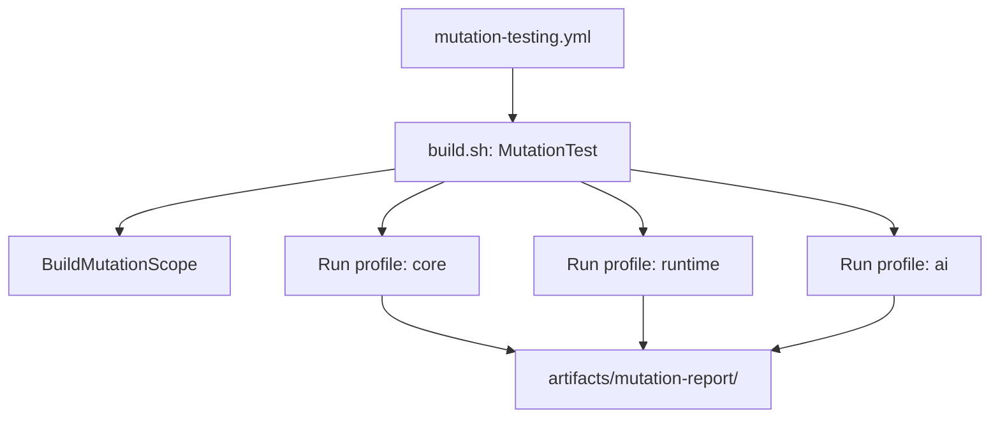

## Context

Mutation testing currently mixes orchestration responsibilities between GitHub workflow YAML and Nuke targets:

- Workflow performs platform-wide build (`BuildAll`)
- Workflow then invokes Stryker directly
- Nuke already has a `MutationTest` target but is not the single source of orchestration

This creates two architectural problems:

1. Scope leakage: full-solution build includes platform heads not required by mutation testing.
2. Governance drift: mutation scope in CI can diverge from repository policy and build-system intent.

## Goals / Non-goals

**Goals**
- Establish Nuke as the single orchestration source for mutation testing.
- Restrict pre-mutation build scope to mutation-relevant projects only.
- Cover required core business projects: Core, Runtime, AI.
- Preserve exclusions for provider wrappers and non-core platform/integration heads.
- Produce profile-separated mutation reports under one artifact root.

**Non-goals**
- Reworking mutation thresholds.
- Introducing workflow matrix orchestration for mutation profiles.
- Running mutation against UI/native/platform head projects.

## Decisions

### Decision 1: Single orchestration entry via Nuke `MutationTest`

Workflow will call only:

- `./build.sh --target MutationTest --configuration Release`

Rationale:
- Keeps orchestration logic in versioned C# build code.
- Avoids duplicated sequencing in YAML (`BuildAll` + direct `dotnet stryker`).
- Enforces one control plane for future mutation policy changes.

### Decision 2: Dedicated `BuildMutationScope` target

Add a new Nuke target that builds only mutation-relevant projects:

- `Agibuild.Fulora.Core`
- `Agibuild.Fulora.Runtime`
- `Agibuild.Fulora.AI`
- `Agibuild.Fulora.UnitTests`

Rationale:
- `BuildAll` is intentionally broad and suited for full analysis scenarios, not mutation preconditions.
- Mutation execution needs deterministic and minimal build prerequisites.
- Reduces CI instability from host-specific platform constraints.

### Decision 3: Profile-based mutation execution in Nuke

Define immutable mutation profiles:

- `core` -> `stryker-config.core.json`
- `runtime` -> `stryker-config.runtime.json`
- `ai` -> `stryker-config.ai.json`

`MutationTest` loops profiles sequentially and writes output into:
- `artifacts/mutation-report/core`
- `artifacts/mutation-report/runtime`
- `artifacts/mutation-report/ai`

Rationale:
- Stryker.NET is project-centric; profile isolation is explicit and debuggable.
- Profile-specific reports improve observability and failure localization.

### Decision 4: Stryker config as single source of truth

Move to root-level profile configs, each with explicit `project` and `mutate` filters.

Rationale:
- Prevents hidden/unused config drift (for example, test-local config files not used by CI).
- Makes scope review straightforward in PRs.

### Decision 5: Governance regression protection

Update governance tests to assert:

- Mutation workflow references `MutationTest`.
- Mutation workflow no longer uses `BuildAll`.
- Mutation workflow no longer invokes `dotnet stryker` directly.

Rationale:
- Prevents orchestration split from reappearing.
- Preserves architectural boundaries in CI over time.

## Data/Control Flow

## Risks / Trade-offs

- **Longer mutation runtime**: three profiles can run longer than a single Core run.
  - Acceptable trade-off for policy alignment and deterministic scope.
- **Potentially lower initial scores on Runtime/AI**:
  - Expected during scope expansion; thresholds remain unchanged in this change.
- **Nuke target growth**:
  - Mitigated by using small profile records and one loop instead of duplicated targets.
